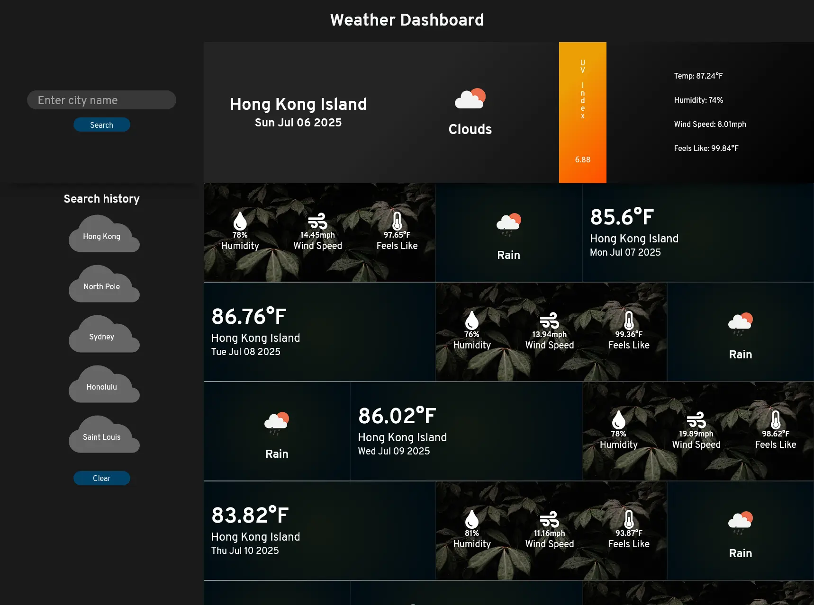

# Weather Dashboard

A dashboard for displaying weather data for a given city. The dashboard displays current weather and forecast for the next
6 days. If enabled, the application automatically provides weather data for the client's current location via [Geolocation API](https://developer.mozilla.org/en-US/docs/Web/API/Geolocation_API).

[View the deployed application](https://theodoremoreland.github.io/WeatherDashboard/)

## Table of contents

- [Technologies used](#technologies-used)
- [Screenshots](#screenshots)
  - [Desktop](#desktop)
  - [Mobile](#mobile)

### Technologies used

- JavaScript (ES6)
- HTML
- CSS
- [OpenWeather API](https://openweathermap.org/api/)
- [Geolocation API](https://developer.mozilla.org/en-US/docs/Web/API/Geolocation_API)
- GitHub Pages

## Screenshots

### Desktop

#### Initial view (Desktop)

#### Filling on city search (Desktop)

#### Loading weather (Desktop)

#### Results 1 (Desktop)

#### Results 1 scrolled down (Desktop)

#### Results 2 (Desktop)

#### Results 3 (Desktop)

#### Results 4 (Desktop)

#### Results 5 (Desktop)

### Mobile

#### Initial view (Mobile)

#### Filling out city search (Mobile)

#### Loading weather (Mobile)

#### Results 1 (Mobile)

#### Results 1 scrolled down (Mobile)

#### Results 2 (Mobile)

#### Results 3 (Mobile)

#### Results 4 (Mobile)

#### Updated search history (Mobile)

