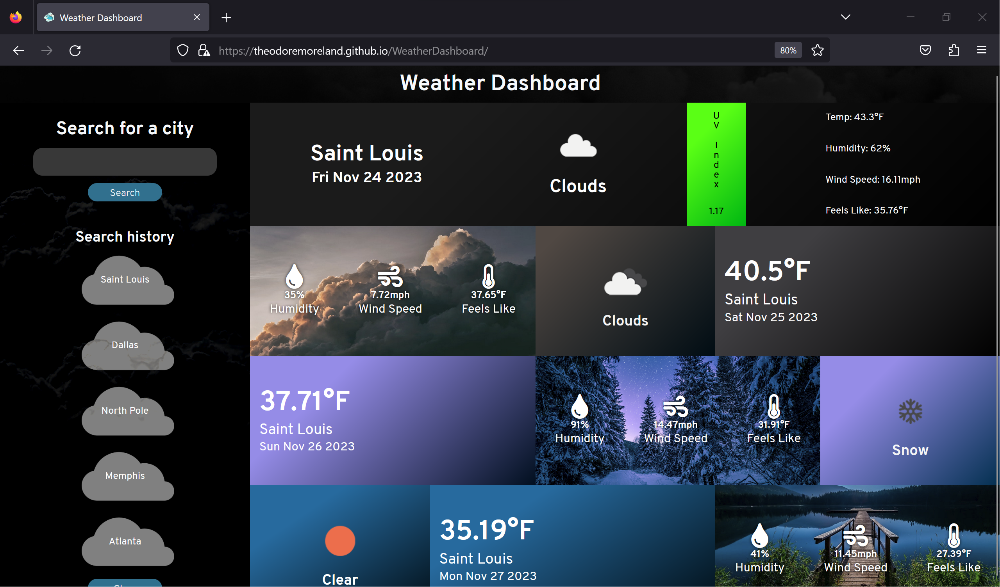

# Weather Dashboard
A dashboard for displaying weather data for a given city. Will display current weather and forecast for the next
6 days.

### Technologies used
- JavaScript (ES6)
- HTML
- CSS
- [OpenWeather API](https://openweathermap.org/api/)
- GitHub Pages

### Future improvements
- Functional / responsivess for small mobile devices when rotated horizontally
- Implement better contrast on colors (e.g. white text on bright background images)
- Downscale background images for faster load times
- Update color scheme for unusual weather conditions in forecast component

# Screenshots

## Default view (Galaxy Fold emulation)

## Default view (desktop)

