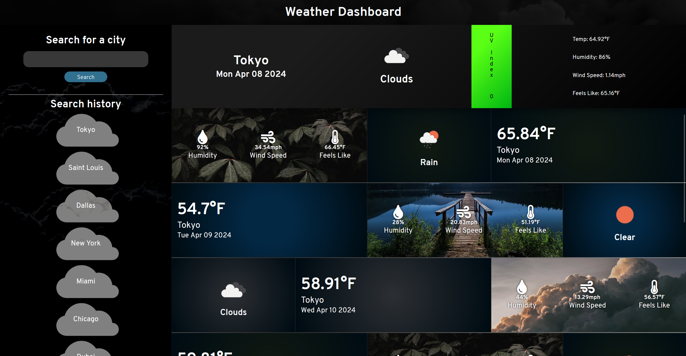
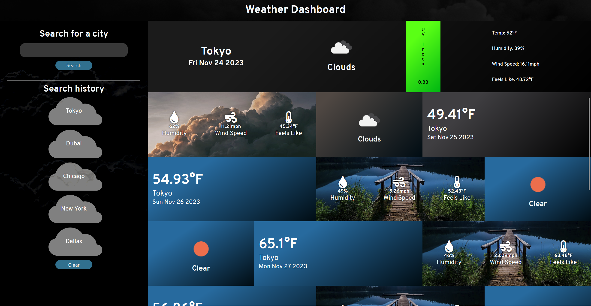
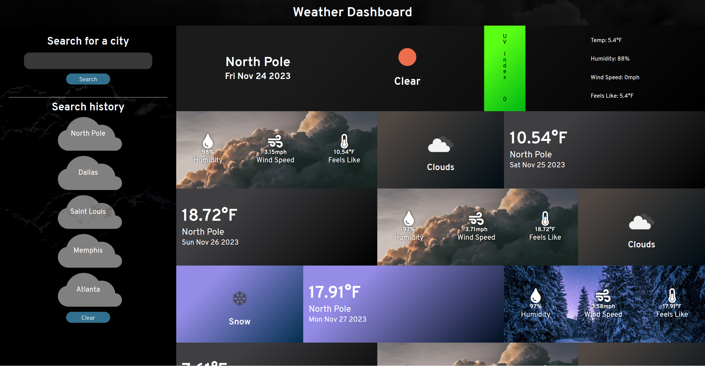

# Weather Dashboard

A dashboard for displaying weather data for a given city. Will display current weather and forecast for the next
6 days.

Visit here: https://theodoremoreland.github.io/WeatherDashboard/

### Technologies used

- JavaScript (ES6)
- HTML
- CSS
- [OpenWeather API](https://openweathermap.org/api/)
- GitHub Pages

# Screenshots (Mobile)

## Results - Phoenix (Mobile)

## Search menu (Mobile)

# Screenshots (Desktop)

## Results - Saint Louis (Desktop)

## Results - Tokyo (Desktop)

## Results - Miami (Desktop)

## Results - North Pole (Desktop)

## Results - Egypt (Desktop)

## Results - Phoenix (Desktop)

