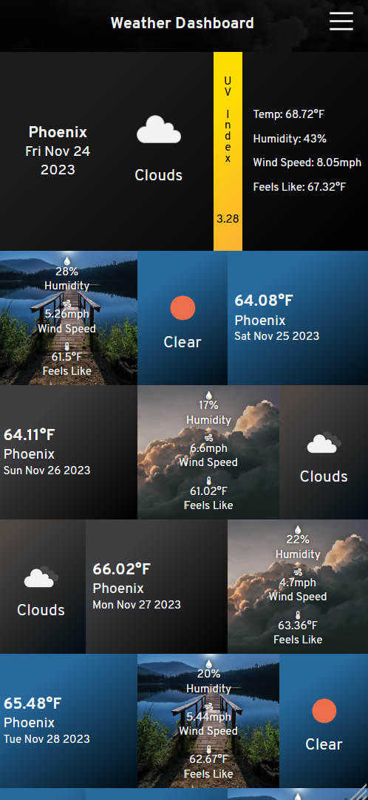

# Weather Dashboard
A dashboard for displaying weather data for a given city. Will display current weather and forecast for the next
6 days.

### Technologies used
- JavaScript (ES6)
- HTML
- CSS
- [OpenWeather API](https://openweathermap.org/api/)
- GitHub Pages

# Screenshots

## Default view (Galaxy Fold emulation)

## Default view - New York City (desktop)

## Saint Louis (desktop)

## International Falls (desktop)

